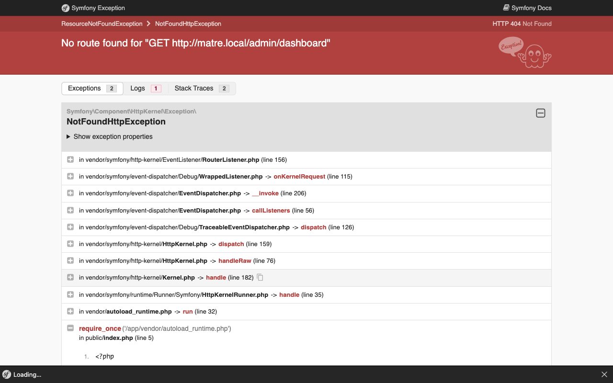
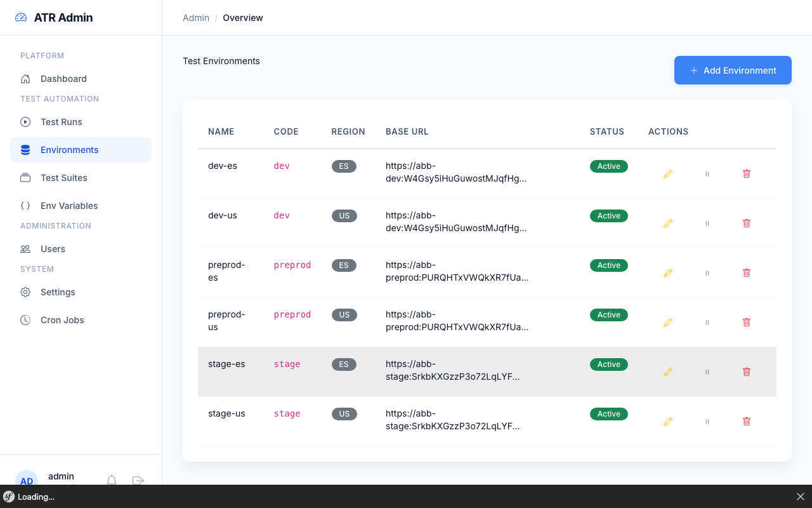
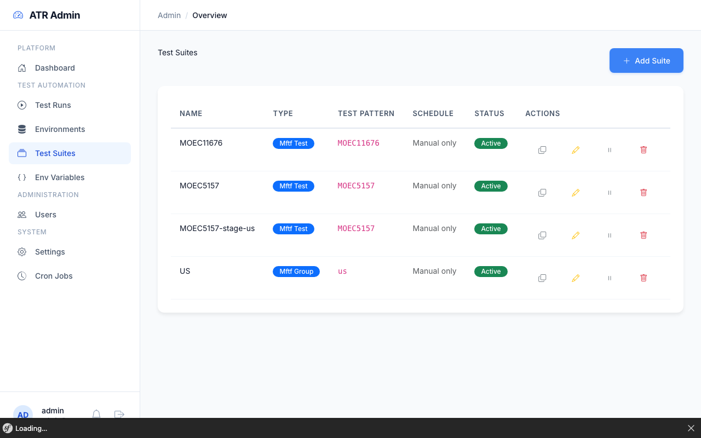

# Quick Start Guide

Get MATRE running and execute your first MFTF test in minutes.

> **Audience:** Developers familiar with MFTF who want to quickly set up and run tests.

> **New to MFTF?** See the [MFTF Setup Guide](./mftf-setup.md) for complete end-to-end instructions including creating your first test module from scratch.



---

## Prerequisites

| Requirement | Details |
|-------------|---------|
| Docker | Docker Desktop or Docker Engine + Compose |
| Test Module | Git repository with MFTF tests (`TEST_MODULE_REPO` in `.env`) |
| Magento Instance | Target environment with MFTF configured |

---

## 1. Start the Environment

```bash
# Clone and start
git clone <repository-url> matre
cd matre
cp .env.example .env

# Configure (edit .env)
# - DATABASE_URL
# - TEST_MODULE_REPO (your MFTF test repository)
# - MAILER_DSN (optional)

# Start all services
docker-compose up -d
```

**Services started:**
- PHP + Nginx (web app)
- MariaDB (database)
- Selenium Grid (MFTF execution)
- Test Worker (async execution)
- Allure (reports)

**Access points:**
| Service | URL |
|---------|-----|
| MATRE App | http://localhost:8080 |
| Selenium Grid | http://localhost:4444 |
| Allure Reports | http://localhost:5050 |
| Mailpit (dev) | http://localhost:8025 |

### Create Admin User

```bash
docker-compose exec php php bin/console app:create-admin
```

Follow prompts to set email and password.

---

## 2. Create Test Environment

A Test Environment represents a target Magento instance where tests will run.

### Option A: Via Admin UI

1. Login to MATRE → Navigate to **Test Automation → Environments**
2. Click **"+ Add Environment"**



3. Fill required fields:

| Field | Example | Description |
|-------|---------|-------------|
| Name | `dev-us` | Display name |
| Code | `dev` | Environment code |
| Region | `us` | Region identifier |
| Base URL | `https://dev-us.example.com/` | Magento storefront URL |
| Backend Name | `admin` | Admin panel path |

4. Optional: Add admin credentials for admin panel tests
5. Click **"Create Environment"**

### Option B: Via CLI (Bulk Import)

Import multiple environments from `.env.*` files:

```bash
# Import from module's Cron/data directory
docker-compose exec php php bin/console app:test:import-env /var/www/html/var/test-modules/current/Cron/data

# Dry run first
docker-compose exec php php bin/console app:test:import-env /path/to/data --dry-run
```

**Expected file format:** `.env.{name}` (e.g., `.env.dev-us`, `.env.stage-es`)

```env
# .env.dev-us
MAGENTO_BASE_URL=https://dev-us.example.com/
MAGENTO_BACKEND_NAME=admin
MAGENTO_ADMIN_USERNAME=admin
MAGENTO_ADMIN_PASSWORD=secret123
```

---

## 3. Import Environment Variables

MFTF tests use `{{_ENV.VARIABLE}}` placeholders. Import these from your test module.

```bash
# Clone fresh module and import interactively
docker-compose exec php php bin/console app:env:import --clone

# Or specify environment directly
docker-compose exec php php bin/console app:env:import dev-us --clone
```

**What happens:**
1. Clones `TEST_MODULE_REPO` to `var/test-modules/current`
2. Scans `.env.*` files in `Cron/data/`
3. Analyzes MFTF XML tests for `{{_ENV.VAR}}` usage
4. Shows import table with test coverage

**Output example:**
```
+----------------------+--------------+------------------+----------+
| Variable             | Value        | Used in Tests    | Status   |
+----------------------+--------------+------------------+----------+
| MAGENTO_BASE_URL     | https://...  | 15 tests         | Created  |
| API_KEY              | sk-xxxx      | 3 tests          | Created  |
| WEBHOOK_SECRET       | ****         | 1 test           | Created  |
+----------------------+--------------+------------------+----------+
```

**Options:**
- `--dry-run`: Preview without saving
- `--overwrite`: Update existing variables

You can also manage environment variables in the Admin UI:


---

## 4. Create Test Suite (Optional)

Test Suites group tests for reuse and scheduling. You can skip this and run tests directly with a filter.

### Via Admin UI

1. Navigate to **Test Automation → Test Suites**
2. Click **"+ Add Suite"**



3. Configure:

| Field | Example | Description |
|-------|---------|-------------|
| Name | `Checkout Tests` | Suite name |
| Type | `MFTF Group` | MFTF_GROUP, MFTF_TEST, PLAYWRIGHT_GROUP, PLAYWRIGHT_TEST |
| Test Pattern | `@checkout` | Group name, test name, or grep pattern |
| Cron Expression | `0 2 * * *` | Optional: auto-run at 2 AM daily |

**Test Pattern Examples:**
| Pattern | Matches |
|---------|---------|
| `MOEC1625Test` | Single test by name |
| `@checkout` | All tests in checkout group |
| `@smoke` | All smoke tests |
| `Checkout` | Tests containing "Checkout" |

4. Click **"Create Suite"**

---

## 5. Run Your First Test

### Option A: Via Admin UI

1. Navigate to **Test Automation → Test Runs**
2. Click **"Start New Run"**


3. Configure:
   - **Environment:** Select your target (e.g., `dev-us`)
   - **Type:** `MFTF`
   - **Suite:** Select a suite OR leave empty
   - **Test Filter:** Override with specific test (e.g., `MOEC1625Test`)

4. Click **"Start Run"**

5. Monitor progress on the details page (auto-refreshes every 10s)


### Option B: Via CLI

```bash
# Run specific test (async - returns immediately)
docker-compose exec php php bin/console app:test:run mftf dev-us --filter="MOEC1625"

# Run and wait for completion (sync)
docker-compose exec php php bin/console app:test:run mftf dev-us --filter="MOEC1625" --sync

# Run a test group
docker-compose exec php php bin/console app:test:run mftf dev-us --filter="@checkout"

# Run using a suite
docker-compose exec php php bin/console app:test:run mftf dev-us --suite="Checkout Tests"

# Run all tests (no filter)
docker-compose exec php php bin/console app:test:run mftf dev-us --sync
```

**CLI Output (sync mode):**
```
Starting test run #42...
Environment: dev-us
Type: MFTF
Filter: MOEC1625

Phase 1/5: Preparing...
Phase 2/5: Executing tests...
Phase 3/5: Generating reports...
Phase 4/5: Collecting artifacts...
Phase 5/5: Cleanup...

Results:
+--------+--------+---------+---------+
| Passed | Failed | Broken  | Skipped |
+--------+--------+---------+---------+
| 1      | 0      | 0       | 0       |
+--------+--------+---------+---------+

Test run completed successfully.
```

---

## 6. View Results

### Test Run Details

Navigate to the test run or click the notification.


**Results include:**
- **Summary:** Pass/fail/broken/skipped counts with progress bar
- **Test Table:** Individual test status, duration, error messages
- **Screenshots:** Gallery with lightbox (click to enlarge)
- **Artifacts:** HTML reports, JSON data
- **Output Log:** Full execution log

### Screenshots Gallery

Failed tests automatically capture screenshots. Click any thumbnail to view full size.

### Allure Reports

For detailed analytics:
1. Click **"View Allure Report"** on the test run page
2. Or access directly: http://localhost:5050

Allure provides:
- Test timeline
- Categories (broken, failed, passed)
- Trends across runs
- Environment metadata

---

## Quick Reference

### Common CLI Commands

```bash
# Test execution
app:test:run mftf <env> [--filter=<pattern>] [--suite=<name>] [--sync]
app:test:run playwright <env> [--filter=<pattern>] [--sync]

# Environment management
app:test:import-env <path> [--dry-run] [--overwrite]
app:env:import [<env>] --clone [--dry-run] [--overwrite]

# System
app:create-admin                    # Create admin user
app:check-magento <env>             # Validate Magento connectivity
app:cron:list                       # List scheduled jobs
app:cron:run <job-id>               # Run job manually
```

### Test Types

| Type | CLI Value | Description |
|------|-----------|-------------|
| MFTF | `mftf` | Magento Functional Testing Framework |
| Playwright | `playwright` | Playwright browser tests |
| Both | `both` | Run MFTF then Playwright |

### Test Run States

| Status | Description |
|--------|-------------|
| Pending | Queued, waiting for worker |
| Running | Currently executing |
| Completed | Finished successfully |
| Failed | Finished with test failures |
| Cancelled | Manually cancelled |

---

## Troubleshooting

### Environment locked
Another test is running on this environment. Wait for completion or cancel the running test.

### Module clone failed
Check `TEST_MODULE_REPO` in `.env` and ensure git credentials are configured.

### Selenium unreachable
```bash
docker-compose ps  # Check selenium-hub is running
docker-compose logs selenium-hub
```

### Tests timeout
Increase timeout in environment settings or check Magento instance health.

---

## Next Steps

- [Configuration Guide](./configuration.md) - Advanced settings
- [Test Execution Details](../operations/test-execution.md) - 5-phase pipeline
- [Scheduling Tests](../operations/scheduling.md) - Cron automation
- [CLI Reference](../operations/cli-reference.md) - All commands
- [Troubleshooting](../operations/troubleshooting.md) - Common issues
