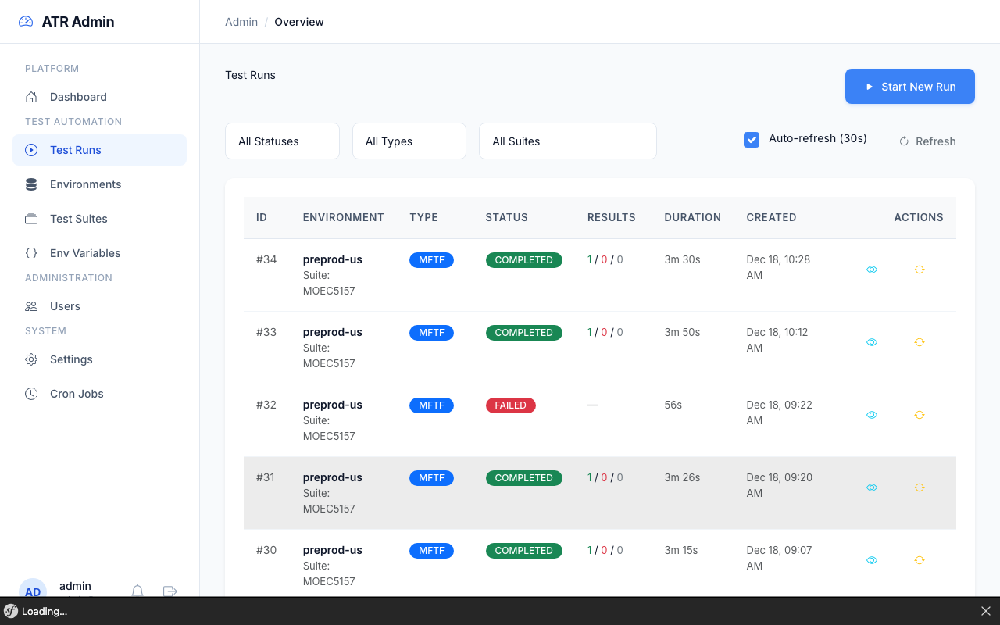
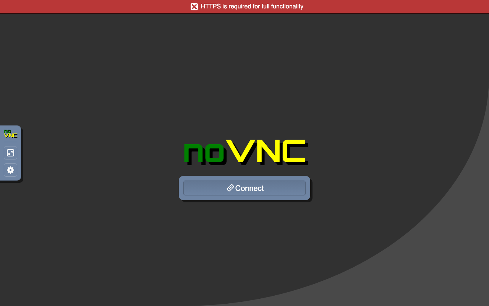
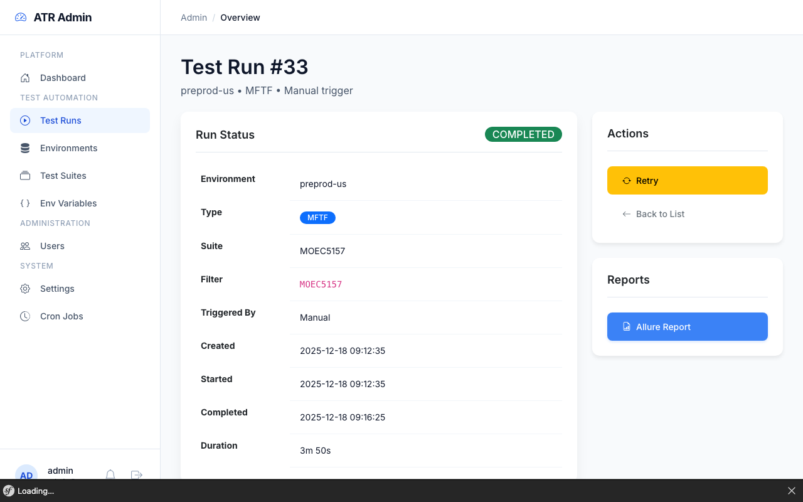
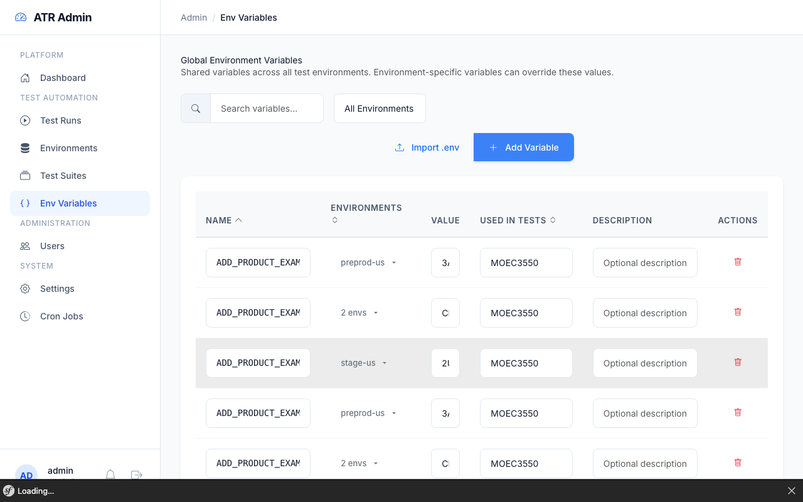

# Running Tests

Complete guide for executing MFTF and Playwright tests.



---

## Prerequisites

Before running tests, ensure:

1. **Installation complete** - See [Installation Guide](../getting-started/installation.md)
2. **Test environment configured** - See [Configuration](../getting-started/configuration.md#test-environment-configuration)
3. **Health check passes:**
   ```bash
   docker-compose exec php php bin/console app:test:check-magento
   ```

---

## Via Admin UI

### Create Test Run

1. Navigate to **Test Runs** in sidebar
2. Click **New Test Run**
3. Select **Environment** (configured in Admin → Test Environments)
4. Choose **Type:**
   - MFTF - Magento Functional Testing Framework
   - Playwright - Modern E2E testing
   - Both - Combined execution with merged reports
5. Optional: Select **Suite** or enter **Filter** pattern
6. Click **Start**

### Monitor Progress

Test runs display real-time status updates:

```
pending → preparing → cloning → running → reporting → completed
```

| Status | Description |
|--------|-------------|
| pending | Queued for execution |
| preparing | Setting up test environment |
| cloning | Fetching test module from repository |
| running | Executing tests |
| reporting | Generating Allure report |
| completed | Finished successfully |
| failed | Execution error occurred |
| canceled | Manually stopped |

### Live Browser Preview

Watch test execution in real-time via browser-based VNC viewer:

1. While test is in `preparing`, `cloning`, or `running` status
2. Click **Watch Live** button in Actions panel
3. New tab opens with noVNC showing the browser automation



> **Note:** Requires `NOVNC_URL` configured in `.env`. See [Configuration](../getting-started/configuration.md#live-browser-preview).

### View Results



- **Summary:** Pass/fail/skipped counts, total duration
- **Details:** Individual test outcomes with error messages
- **Screenshots:** Click thumbnails to view full failure screenshots
- **Reports:** Link to Allure HTML report

---

## Via CLI {#cli}

### Basic Usage

```bash
docker-compose exec php php bin/console app:test:run <type> <environment> [options]
```

**Arguments:**
| Argument | Values | Description |
|----------|--------|-------------|
| type | `mftf`, `playwright`, `both` | Test framework to execute |
| environment | environment code | Target environment (e.g., `staging`, `production`) |

**Options:**
| Option | Example | Description |
|--------|---------|-------------|
| `--filter` | `--filter=Checkout` | Run specific test or group |
| `--suite` | `--suite=smoke` | Use predefined test suite |
| `--sync` | `--sync` | Wait for completion (blocking) |

### Sync Execution (Blocking)

Waits for test completion, shows results inline:

```bash
docker-compose exec php php bin/console app:test:run mftf staging --sync
```

Output:
```
Starting test run #42 on staging...
Type: mftf
Status: running

✓ AdminLoginTest (2.3s)
✓ StorefrontCategoryTest (5.1s)
✗ StorefrontCheckoutTest (12.4s)
  Error: Element not found: #place-order-button

Completed: 2 passed, 1 failed
Duration: 19.8s
Report: http://localhost:5050/allure-docker-service/projects/run-42/reports/latest
```

### Async Execution

Returns immediately, monitor via UI or API:

```bash
docker-compose exec php php bin/console app:test:run playwright production
```

Output:
```
Test run #43 created and queued.
Monitor at: http://localhost:8089/admin/test-runs/43
```

### Examples

```bash
# Run MFTF smoke tests on staging, wait for results
docker-compose exec php php bin/console app:test:run mftf staging --filter=SmokeTestGroup --sync

# Run all Playwright tests on production (async)
docker-compose exec php php bin/console app:test:run playwright production

# Run both frameworks with a specific suite
docker-compose exec php php bin/console app:test:run both staging --suite=regression --sync

# Run specific test by name pattern
docker-compose exec php php bin/console app:test:run mftf staging --filter=AdminCreateProduct
```

---

## Via API

See [API Reference](api-reference.md#test-runs) for programmatic access:

- `POST /api/test-runs` - Create new run
- `GET /api/test-runs/{id}` - Get run details
- `POST /api/test-runs/{id}/cancel` - Cancel running test
- `POST /api/test-runs/{id}/retry` - Retry failed test

---

## Test Types

| Type | Framework | Best For |
|------|-----------|----------|
| **MFTF** | Codeception + Selenium | Magento admin panel, checkout flows, complex Magento interactions |
| **Playwright** | Node.js + Chromium | Fast E2E tests, modern JS-based testing, cross-browser |
| **Both** | Combined | Full coverage, merged Allure reports |

### MFTF Tests

- Executed via Magento's Functional Testing Framework
- Requires Selenium Grid (chrome-node)
- Tests stored in `TEST_MODULE_REPO` under `Test/Mftf/`
- Results parsed from `TESTS.xml`

#### Environment Variable Resolution

MATRE analyzes which tests use which environment variables by scanning:
1. Direct `{{_ENV.VAR_NAME}}` references in test XML files
2. ActionGroup references - resolves `{{ActionGroupName.VAR}}` to actual test names

**Example:** If `LoginTest.xml` uses `<actionGroup ref="AdminLogin"/>` and `AdminLogin` uses `{{_ENV.ADMIN_PASSWORD}}`, MATRE correctly associates `ADMIN_PASSWORD` with `LoginTest`.

This allows the "Used in Tests" column in Admin → Environment Variables to show accurate test coverage.



### Playwright Tests

- Executed via npx playwright
- Built-in browser (Chromium)
- Tests stored in `TEST_MODULE_REPO` under `tests/`
- Results parsed from JSON reporter output

---

## Execution Pipeline

```
┌─────────┐    ┌───────────┐    ┌─────────┐    ┌─────────┐    ┌───────────┐    ┌───────────┐
│ pending │ → │ preparing │ → │ cloning │ → │ running │ → │ reporting │ → │ completed │
└─────────┘    └───────────┘    └─────────┘    └─────────┘    └───────────┘    └───────────┘
                    │               │             │               │
                    ↓               ↓             ↓               ↓
               Module prep    Git clone    MFTF/Playwright    Allure
               validation     from repo    execution          generation
```

### Phase Details

1. **Preparing** - Validate environment, check prerequisites
2. **Cloning** - Clone test module from `TEST_MODULE_REPO` (or symlink if `DEV_MODULE_PATH` set)
3. **Running** - Execute tests via MFTF or Playwright executor
4. **Reporting** - Merge results, generate Allure HTML report
5. **Completed/Failed** - Final status with results stored

---

## Environment Locking

Only one test can run per environment at a time to prevent conflicts.

If you see "Environment is locked":
1. Wait for current test to complete
2. Cancel the running test via Admin UI
3. Check for stuck runs in scheduler

---

## Test History

Track a specific test's execution across multiple runs to identify flaky tests, regressions, or performance trends.

### Access Test History

**Option 1: From sidebar**
1. Navigate to **Test History** in sidebar
2. Select a test ID from the searchable dropdown
3. Choose an environment
4. Click **Search**

**Option 2: From test results**
1. Open any **Test Run** detail page
2. Find the test in results table
3. Click **History** button next to the test ID

### History View

Displays a timeline of the selected test's executions:

| Column | Description |
|--------|-------------|
| Status | Pass/Fail/Skipped/Broken badge |
| Test Run | Link to the full test run |
| Duration | Execution time in seconds |
| Date | When the test ran |

### Switch Environment

Use the environment dropdown in the history view header to compare the same test's performance across different environments without leaving the page.

### Use Cases

- **Flaky test detection** - Tests that intermittently fail
- **Regression tracking** - When a previously passing test starts failing
- **Performance monitoring** - Duration trends over time
- **Environment comparison** - Same test behaving differently per environment

---

## Troubleshooting

See [Troubleshooting Guide](troubleshooting.md#test-execution) for common issues:
- Environment locked
- Module clone failed
- Selenium unreachable
- Test timeout
