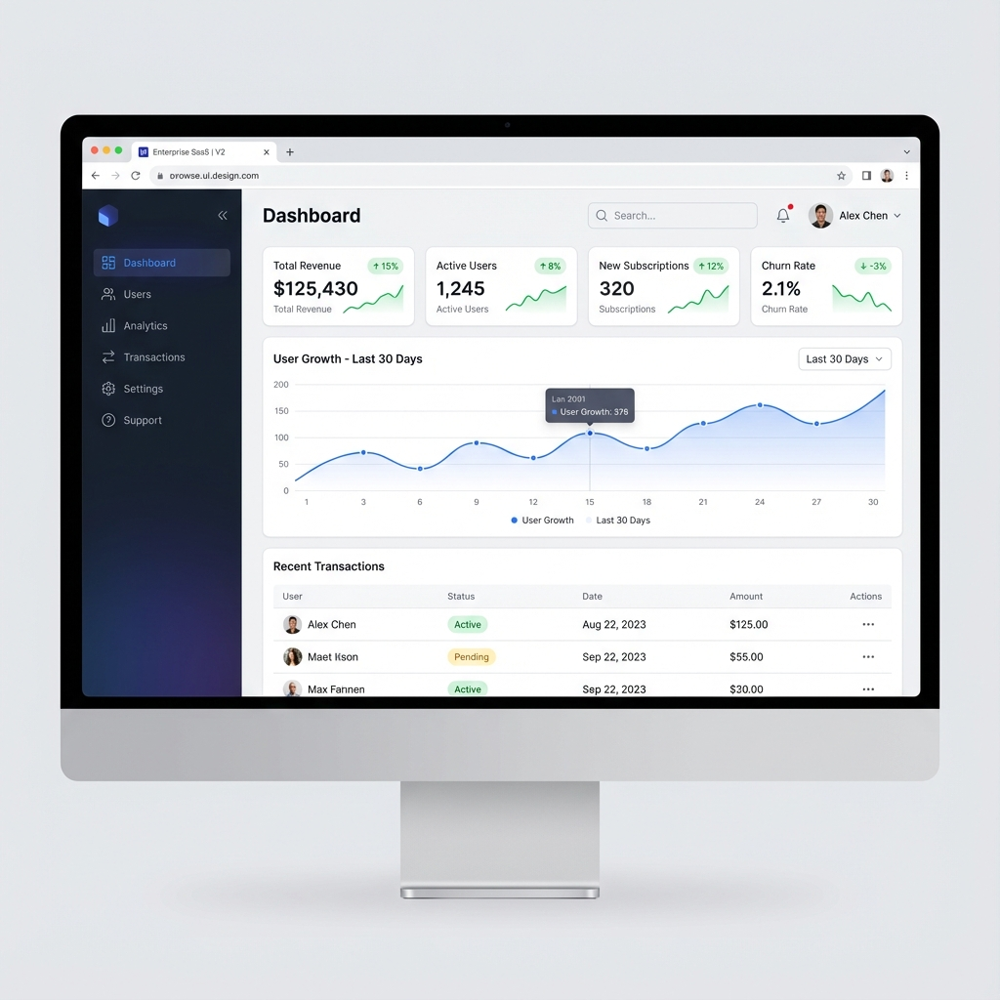

# Refined Design: Premium Enterprise SaaS

This is the refined design concept (V2) saved for future implementation.

## Design Features

- **Visual Hierarchy**: Clear separation between navigation, metrics, and data.
- **Rich Metrics**: Sparklines (mini-charts) and trend indicators in top cards.
- **Data Visualization**: Main chart area for tracking performance.
- **Modern Table Design**: Avatar placeholders and status chips.
- **Refined Palette**: Deep indigo/slate sidebar with white content area.

## Implementation Plan

1. **Sidebar Layout**: Refactor the current top-navbar `base.html.twig` to a sidebar layout.
2. **Dashboard Components**:
    - Create `MetricCard` Vue component.
    - Create `ChartWidget` using Chart.js.
3. **Table Makeover**: Update Bootstrap table classes to match the card style.
